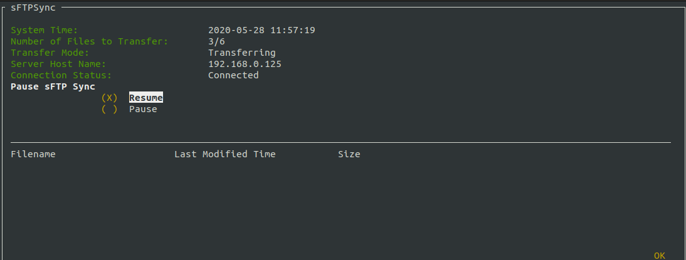
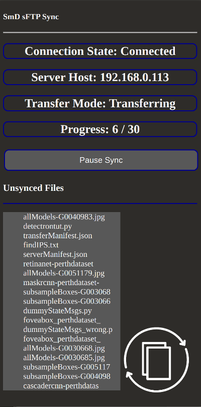

# ftpsync

A simple process for creating Dropbox like sync between a Ubuntu client PC and a Raspberry Pi file server using sftp tools over a local network or VPN. 

The sync process is based around manifest files. serverManifest.json and clientManifest are python dicts containing files and file properties on the file server and client machines. These are compared to find files that need to be synced. Based on this a transferManifest.json file is created, this contains a python dict of files that need to be transferred (dict keys are the SHA256 hash of each file) and a dict of files that need to be archived. The client machine iterates through this dict and uses sftp to transfer the files necessary.

Includes a 1980s aesthetic Terminal GUI using npyscreens and a more modern replacement based on the Electron framework.

# Features that work
    1. Automatically syncs new files to file server to mirror client file structure
    2. GUI updates with state of sync script, GUI can be run and killed independantly to sync script
    3. Files that are deleted on client are archived on file server for recovery if needed
    4. Normal expected disconnects and file faults are handled. 
    5. client logging for troubleshooting
    6. Efficient transfer of duplicate files, duplicates are identified by SHA256 hash, duplicate files are only transferred once and then copied on file server
    7. All files have checksums (SHA256) to ensure they are transferred correctly without any missing data. 
    8. Terminal based GUI and Javascript based replacement.
    
# features to add
    1. Fix Known hosts check 
    2. File version tracking
    3. Change GUI updates from IP sockets to UDS.
    4. more efficient handling if files are moved to different directories (currrently they need to be retransferred instead of just moved on file server)
    5. multi client support (including mobile)
    6. Make pause function work
    7. Add list of unsynced files